# GharDekho — Property Rental Portal

A responsive Django-based rental property portal inspired by NoBroker. Property owners can list, edit, and manage rental properties. Tenants can search, filter, view property details, express interest, and save properties to a wishlist.

Built as a college submission project (Internship Assignment: Build a Property Rental Web Application).

🔗 **Live Demo:** https://ghardekho-hh5j.onrender.com

---

## Tech Stack

**Backend:** Python 3.12+, Django, Django ORM, PostgreSQL (production) / SQLite (local development)
**Frontend:** HTML5, CSS3, Bootstrap 5, JavaScript
**Media Storage:** Cloudinary (production), local filesystem (development)
**Static Files:** WhiteNoise
**Deployment:** Render
**Version Control:** Git, GitHub

---

## Features

### Authentication
- User registration, login, logout
- Password validation (Django's built-in validators)

### Property Management (Owner)
- Add, edit, and delete property listings
- Ownership checks — owners can only edit/delete their own properties
- Fields: title, property type, rent, deposit, BHK, furnished status, address, city, area, description, contact number, image
- Property Status (Available / Rented) with visual badge

### Property Search (Public)
- Filter by city, area, BHK, rent range, property type, furnished status
- Sort by lowest rent, highest rent, or latest
- Pagination with filters preserved across pages
- Reset filters
- Rented properties automatically excluded from public search results

### Property Details
- Full property information: images, description, owner name, rent, deposit, location, contact number
- "Interested" — tenants can express interest and optionally send a message to the owner
- Duplicate interest prevented (one interest per tenant per property)
- Wishlist — tenants can save/remove properties for later (toggle button)

### Owner Dashboard
- Total properties listed
- Total interested users across all owned properties
- Recent properties list
- List of interested tenants and their messages, per property

### User Profile
- Edit profile (name, email, phone, city, role)
- Profile photo upload
- Change password

### Validation
- Required field validation
- Rent must be greater than 0
- Deposit cannot be negative
- Contact number must be exactly 10 digits
- Form errors displayed under each field

### Responsive Design
- Works across desktop, tablet, and mobile (Bootstrap grid)

---

## Local Setup Instructions

1. **Clone the repository**
   ```bash
   git clone https://github.com/onkarbirajdaar/property-rental-portal.git
   cd property-rental-portal
   ```

2. **Create and activate a virtual environment**
   ```bash
   python -m venv venv
   # Windows
   venv\Scripts\Activate.ps1
   # macOS/Linux
   source venv/bin/activate
   ```

3. **Install dependencies**
   ```bash
   pip install -r requirements.txt
   ```

4. **Create a `.env` file** in the project root with:
   ```
   SECRET_KEY=your-secret-key
   DEBUG=True
   ```
   (Leave `DATABASE_URL` and Cloudinary variables unset to run locally with SQLite and local media storage — these are only required for production deployment.)

5. **Apply migrations**
   ```bash
   python manage.py makemigrations
   python manage.py migrate
   ```

6. **Create a superuser (for admin access)**
   ```bash
   python manage.py createsuperuser
   ```

7. **Run the development server**
   ```bash
   python manage.py runserver
   ```

8. Visit `http://127.0.0.1:8000/` in your browser. Admin panel available at `http://127.0.0.1:8000/admin/`.

---

## Deployment

Deployed on **Render** (Web Service) with:
- **PostgreSQL** (Render-managed) as the production database
- **Cloudinary** for persistent property/profile image storage
- **WhiteNoise** for serving static files
- **Gunicorn** as the production WSGI server

Environment variables (`SECRET_KEY`, `DEBUG`, `DATABASE_URL`, `ALLOWED_HOSTS`, `CLOUDINARY_CLOUD_NAME`, `CLOUDINARY_API_KEY`, `CLOUDINARY_API_SECRET`) are configured directly in Render's dashboard and never committed to source control.

---

## Database Schema

**User** (Django's built-in auth model)
- id, username, email, password, first_name, last_name

**Profile** (OneToOneField → User)
- user, phone, city, role, photo

**Property**
- id, owner (FK → User), title, property_type, rent, deposit, bhk, furnished, status, address, city, area, description, contact_number, image, created_at

**Interest**
- id, property (FK → Property), tenant (FK → User), message, created_at
- Unique together: (property, tenant)

**Wishlist**
- id, property (FK → Property), user (FK → User), created_at
- Unique together: (property, user)

---

## Screenshots

### Home Page
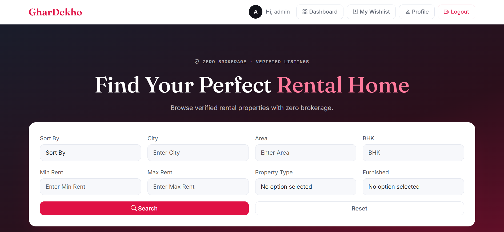

### Search Results
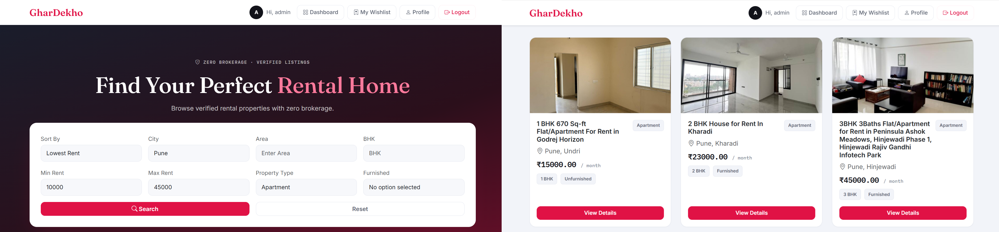

### Property Detail — Tenant View
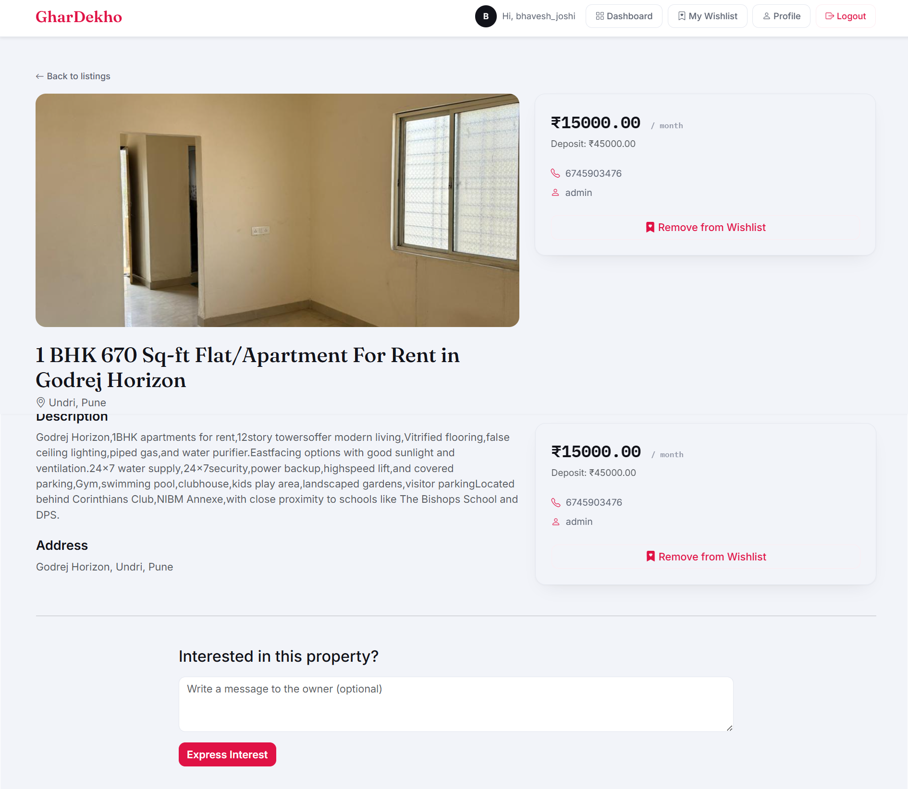

### Add Property
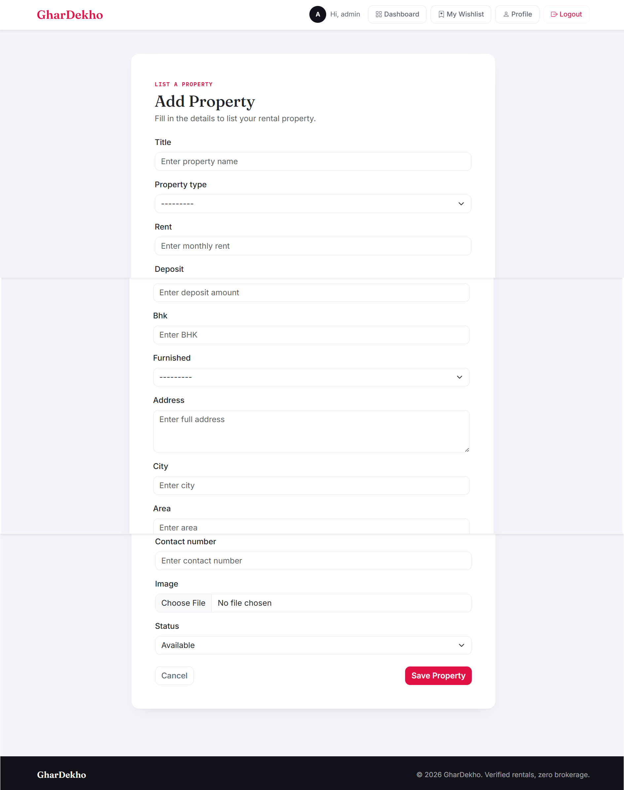

### My Properties
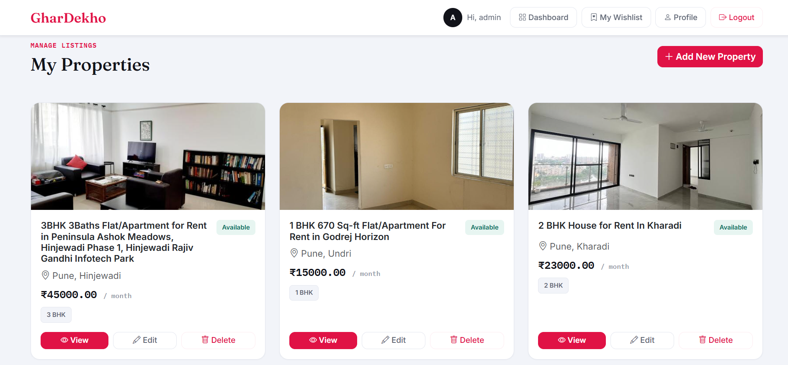

### Edit Property
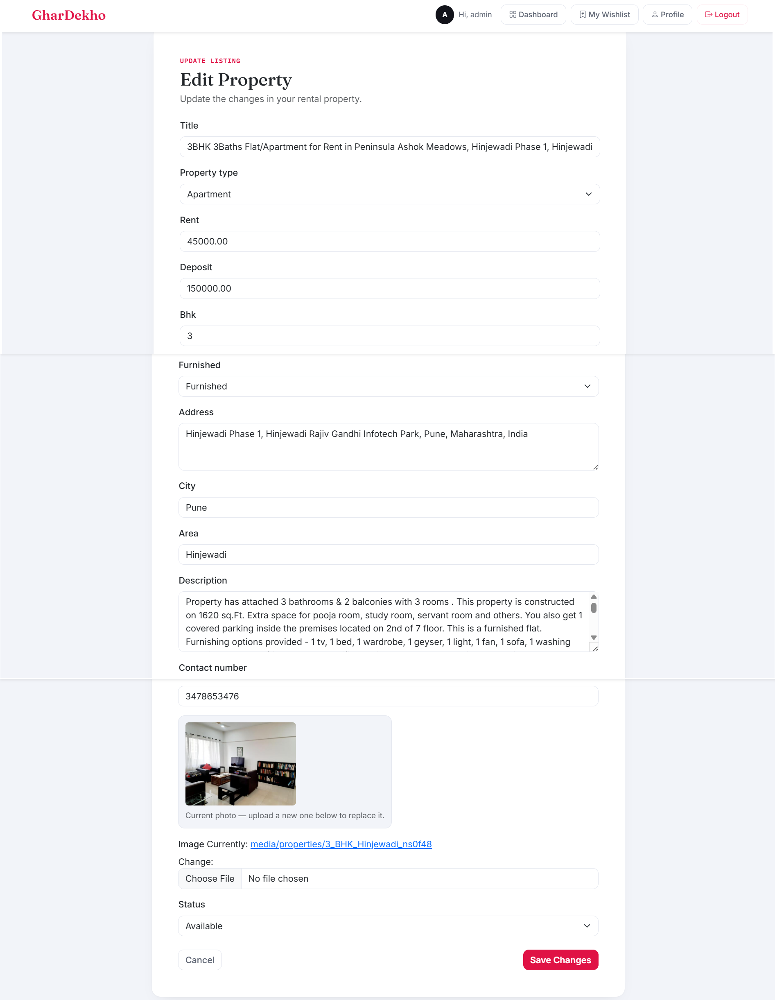

### Delete Confirmation
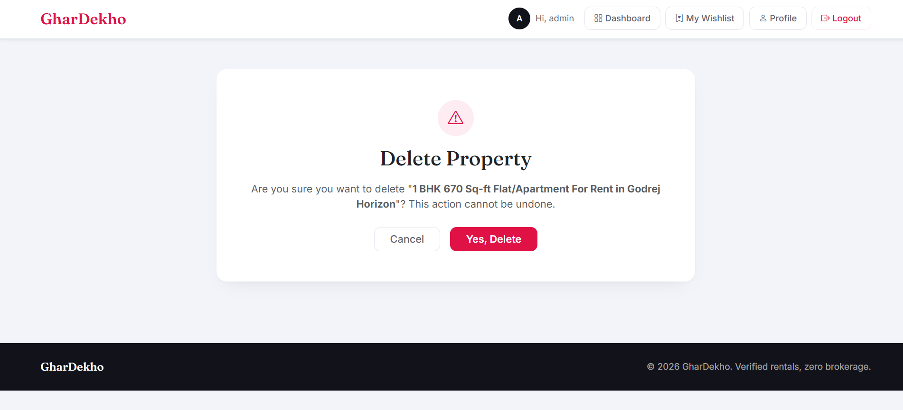

### Owner Dashboard
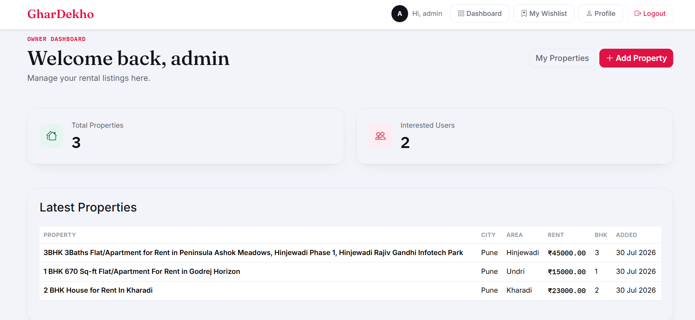

### Property Detail — Owner View (Interested Tenants)
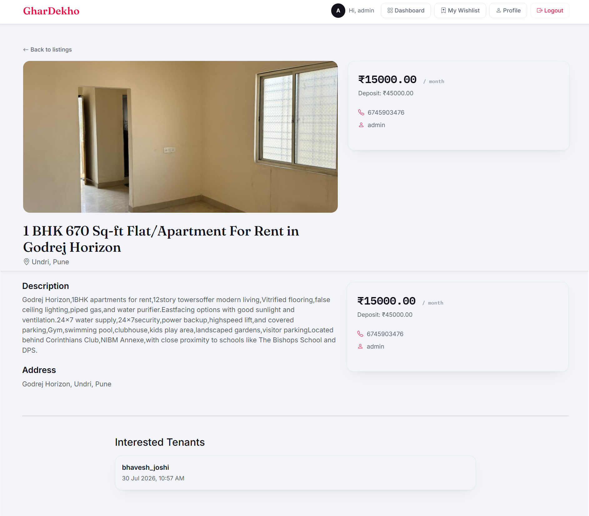

### My Wishlist
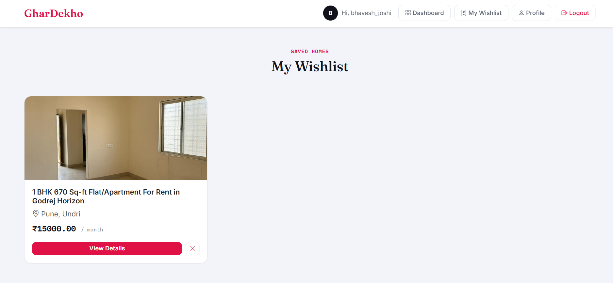

### Login / Register
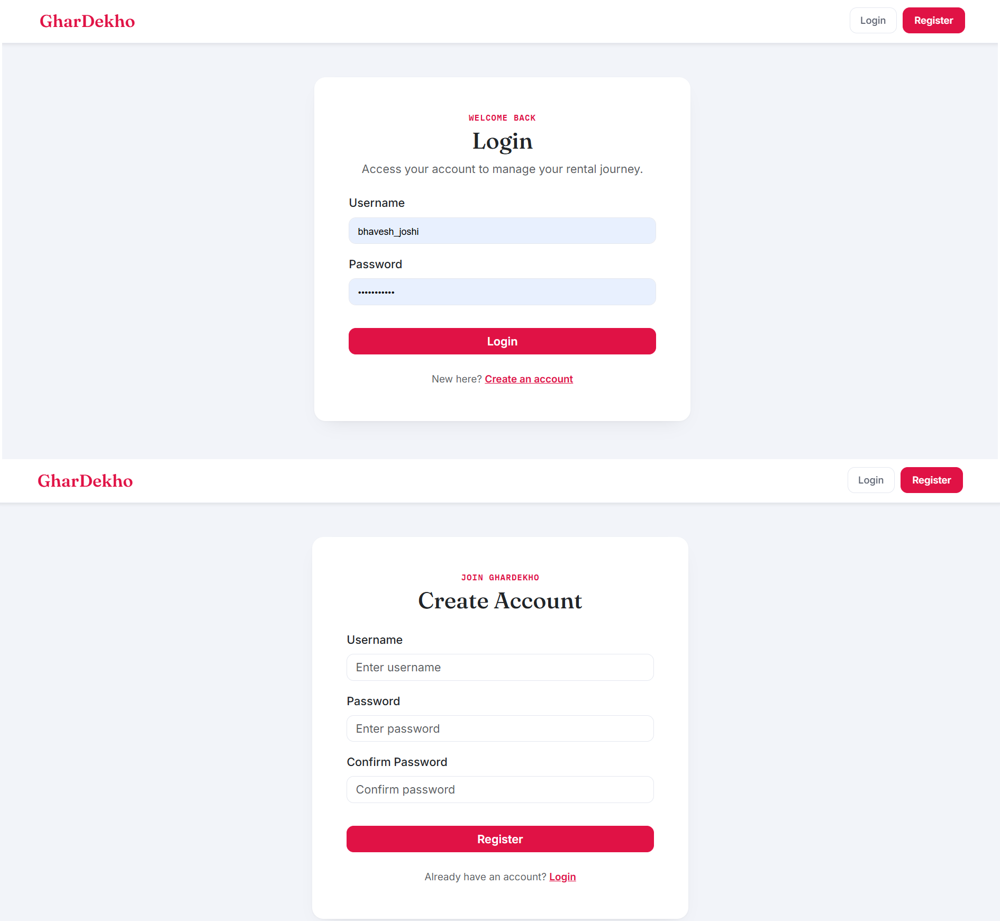

---

## Known Issues

- Email notification when a tenant expresses interest is not implemented (planned as a future improvement)
- No image gallery — properties support a single image only
- "Forgot password" flow is not implemented

---

## Future Improvements

- Email notifications on new interest
- Google Maps integration for property location
- Property image gallery (multiple images per listing)
- Dark mode
- AJAX-based live search (no page reload)

---

## Project Structure

```
property_portal/
├── accounts/          # Authentication, profile, dashboard
├── properties/        # Property CRUD, search, interest, wishlist
├── templates/          # Shared templates, components
├── static/              # CSS, JS
├── media/               # Uploaded property/profile images (local dev only)
├── screenshots/          # README screenshots
├── Procfile              # Render process definition
├── build.sh              # Render build script
├── requirements.txt
└── manage.py
```

---

## Author

Onkar Birajdar
